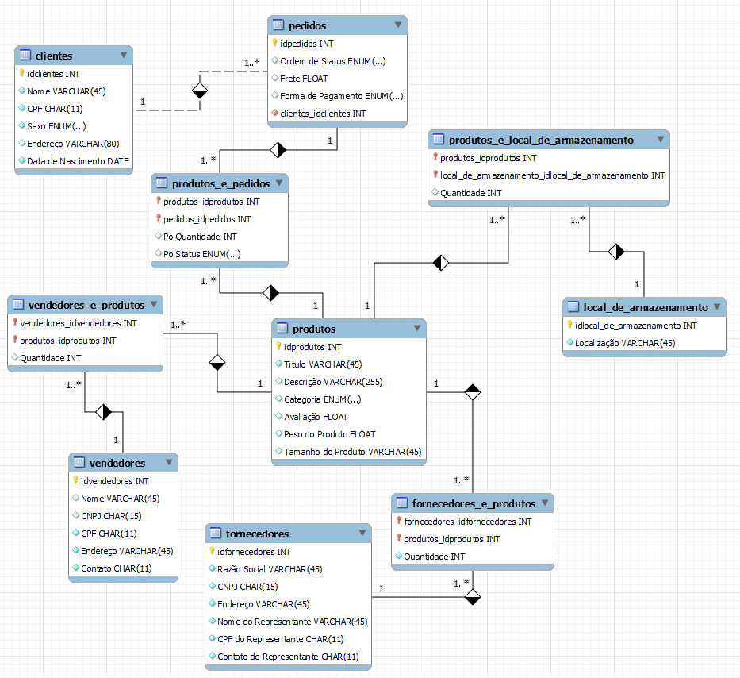

# MySql_Projeto_DIO

Projeto DIO com MYSQL

## Antonio Victor

- Recuperações simples com SELECT Statement
- Filtros com WHERE Statement
- Crie expressões para gerar atributos derivados
- Defina ordenações dos dados com ORDER BY
- Condições de filtros aos grupos – HAVING Statement
- Crie junções entre tabelas para fornecer uma perspectiva mais complexa dos dados

# Diagrama EER Ecommercer

# Algumas Funções de Pesquisa.

### Selecionar Todos os Clientes Que são de Maceió.

* select c.Nome, c.CPF, c.Endereco from clientes c where c.Endereco like "%Maceió%";

### Selecionar Todos os Produtos e Ordenar por Preço.

* select titulo Título, descricao Descrição, preco Preço, categoria Categoria  from produtos p order by preco;

### Selecionar Todos os Produtos Fazer cálculo de Ecommercer para Diferentes Tipos de Pagamentos, mostrar seu novo preço/acréscimo e Ordenar por Título.

* select titulo Título, descricao Descrição, preco Preço_À_Vista, round(preco+(preco*0.12),2) 
Preço_Prazo, round((preco+(preco*0.12))/10,2) Parcela_Em_Até_10x, round(preco*0.12,2) Acréscimo_de, categoria Categoria  
from produtos p 
order by titulo;

### Selecionar Todos os Produtos que seu preço seja maior ou igual a 2499, e aplicar um desconto de acordo com a forma de pagamento, se for pix desconto de 25%, demais pagamento desconto de 15% e Ordenar por Título.

* select titulo Título, descricao Descrição, preco Preço_sem_Promoção, round(preco-(preco*0.15),2) as Preço_Com_Promoção, round((preco-(preco*0.25)),2) Preço_Com_Promoção_no_PIX 
from produtos p 
where preco >= 2499
order by titulo;

### Selecionar Todos os Clientes e mostrar a idade de cada um atraves de um cálculo pela data de nascimento.

* SELECT Nome, DataDeNascimento Data_de_Nascimento, concat(YEAR(CURRENT_DATE) - YEAR(DataDeNascimento) - (RIGHT(CURRENT_DATE, 5) < RIGHT(DataDeNascimento, 5)),' Anos')  Idade
FROM clientes;